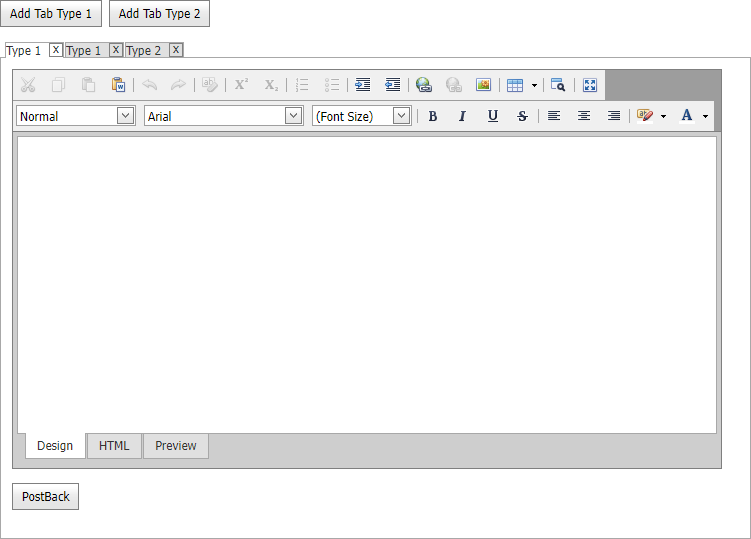

<!-- default badges list -->

[](https://supportcenter.devexpress.com/ticket/details/E4113)
[](https://docs.devexpress.com/GeneralInformation/403183)
[](#does-this-example-address-your-development-requirementsobjectives)
<!-- default badges end -->

# ASP.NET Web Forms - How to dynamically add and remove controls in ASPxCallbackPanel on callbacks

This example demonstrates how to dynamically add and remove controls in [ASPxCallbackPanel](https://docs.devexpress.com/AspNet/DevExpress.Web.ASPxCallback) on callbacks. 

In this example, `ASPxCallbackPanel` contains [ASPxPageControl](https://docs.devexpress.com/AspNet/DevExpress.Web.ASPxPageControl). Buttons at the top of the page allow users to dynamically add tab pages with custom content to the `ASPxPageControl` on callbacks.



View state is not applied in this scenario and should be disabled (the [EnableViewState](https://learn.microsoft.com/en-us/dotnet/api/system.web.ui.control.enableviewstate) property is set to `false`). 

```aspx
<dx:ASPxCallbackPanel ID="CallbackPanel" runat="server" ClientInstanceName="callbackPanel" OnCallback="CallbackHandler">
    <PanelCollection>
        <dx:PanelContent>
            <dx:ASPxPageControl ID="PageControl" runat="server" EnableViewState="false" Height="500" Width="100%">
    <!-- ... -->
</dx:ASPxCallbackPanel>
```

When a user clicks a button, a [Click](https://docs.devexpress.com/AspNet/DevExpress.Web.ASPxButton.Click) event handler calls the [PerformCallback](https://docs.devexpress.com/AspNet/js-ASPxClientCallbackPanel.PerformCallback(parameter)) method to send a callback to the server.

```aspx
<dx:ASPxButton ID="Button1" runat="server" Text="Add Tab Type 1" AutoPostBack="false">
    <ClientSideEvents Click="function(s, e) { AddTab('Type 1'); }" />
</dx:ASPxButton>

<dx:ASPxButton ID="Button2" runat="server" Text="Add Tab Type 2" AutoPostBack="false">
    <ClientSideEvents Click="function(s, e) { AddTab('Type 2'); }" />
</dx:ASPxButton>
```
```js
function AddTab(type) {
    callbackPanel.PerformCallback('add:' + type);
}
```

On the server side, a [Callback](https://docs.devexpress.com/AspNet/DevExpress.Web.ASPxCallbackPanel.Callback) event handler adds or removes tab pages in `ASPxPageControl` and saves information about tabs to a [Session](https://learn.microsoft.com/en-us/dotnet/api/system.web.ui.page.session) object.

```csharp
protected void CallbackHandler(object sender, CallbackEventArgsBase e) {
    string[] parameters = e.Parameter.Split(':');
    string action = parameters[0];
    string target = parameters[1];

    if(action == "remove")
        RemoveTab(int.Parse(target));
    else if(action == "add")
        AddTab(target);
}
```

Since controls are created on callbacks, the [Page.Init](https://learn.microsoft.com/en-us/dotnet/api/system.web.ui.control.init) event is handled to recreate the control hierarchy on page initialization.

```csharp
protected void Page_Init(object sender, EventArgs e) {
    if(!IsPostBack) {
        ClearTabs();
        AddTab("Type 1");
    }
    else {
        RestoreTabs();
    }
}
void RestoreTabs() {
    var tabsInfo = Session["tabs"] as OrderedDictionary;

    if(tabsInfo != null) {
        foreach(DictionaryEntry tabInfo in tabsInfo)
            CreateTab((string)tabInfo.Key, (string)tabInfo.Value);
    }
}
```

## Files to Review
* [Default.aspx](./CS/WebSite/Default.aspx) (VB: [Default.aspx](./VB/WebSite/Default.aspx))
* [Default.aspx.cs](./CS/WebSite/Default.aspx.cs) (VB: [Default.aspx.vb](./VB/WebSite/Default.aspx.vb))
* [TabContentType1.ascx](./CS/WebSite/TabsContent/TabContentType1.ascx) (VB: [TabContentType1.ascx](./VB/WebSite/TabsContent/TabContentType1.ascx))
* [TabContentType2.ascx](./CS/WebSite/TabsContent/TabContentType2.ascx) (VB: [TabContentType2.ascx](./VB/WebSite/TabsContent/TabContentType2.ascx))

## Documentation

* [Callbacks](https://docs.devexpress.com/AspNet/402559/common-concepts/callbacks)
<!-- feedback -->
## Does this example address your development requirements/objectives?

[](https://www.devexpress.com/support/examples/survey.xml?utm_source=github&utm_campaign=asp-net-web-forms-dynamically-add-and-remove-controls-in-callback-panel&~~~was_helpful=yes) [](https://www.devexpress.com/support/examples/survey.xml?utm_source=github&utm_campaign=asp-net-web-forms-dynamically-add-and-remove-controls-in-callback-panel&~~~was_helpful=no)

(you will be redirected to DevExpress.com to submit your response)
<!-- feedback end -->
